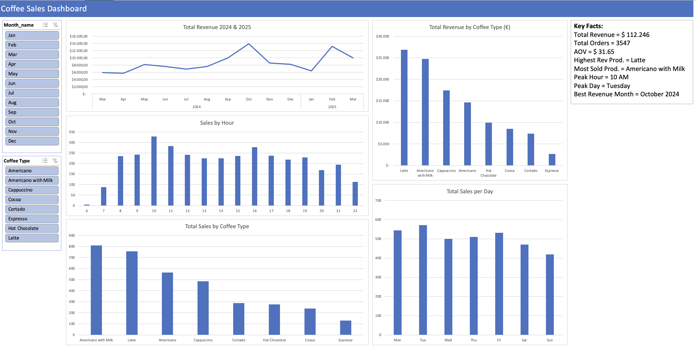

# ☕ Coffee Sales Analysis

This project provides a comprehensive analysis of coffee shop sales data. It combines the power of **Python (Pandas)** for deep data exploration and feature engineering with an **Excel Dashboard** for business-ready visualizations.

## 📊 Project Overview

The goal of this analysis is to identify sales patterns, top-performing products, and customer behavior to derive actionable business insights.

### Key Components:
1. **Python EDA (`coffee-sales-eda.ipynb`)**: 
   - Data cleaning and transformation.
   - Feature engineering (e.g., extracting weekend vs. weekday patterns).
   - Statistical analysis of product performance (Revenue, Sales Count, and Average Price).
2. **Excel Dashboard**:
   - Summary of key performance indicators (KPIs).
   - Visual representation of sales trends.

## 💡 Key Business Insights

* **Revenue Leader**: The **Latte** is the primary revenue driver, contributing the highest total earnings.
* **Volume King**: The **Americano with Milk** has the highest transaction count, making it the most frequently sold item.
* **Price Sensitivity**: Analysis of the **Espresso** reveals a lower sales volume despite its popularity in coffee culture. The high average price point suggests customer price sensitivity for this specific product.
* **Time Patterns**: Data transformation was used to distinguish between weekday and weekend sales (Analysis ongoing).

## 🛠️ Tools Used
* **Python**: Data processing with `Pandas` & `Matplotlib`.
* **Jupyter Notebook**: For documented exploratory data analysis (EDA).
* **Microsoft Excel**: For final dashboarding and business reporting.

## 🚀 How to Use
1. Clone the repository.
2. Open `coffee-sales-eda.ipynb` to see the Python workflow.
3. Check the `.xlsx` file for the visual business report.
